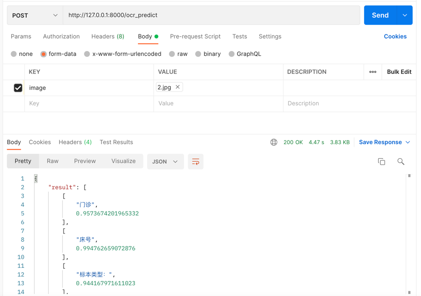

# 1. 基于paddle ocr 的 web接口
## 1.1 安装环境
1. flask
2. paddleocr
3. paddlepaddle

安装这三个库即可

## 1.2 运行原理
+ 运行的前提是你的环境已经准备好了，我建议使用conda来配置环境，然后activate你的环境 
+ 第一种方式是：用pycharm打开它 然后运行paddleocr_app文件即可 
+ 第二种方式：当然你也可以cd到项目目录，直接在命令行中输入python paddleocr_app
+ 后端逻辑：前端传入图片之后后端会将这个图片保存到uploads文件夹中，然后后端调用paddle ocr来对图片进行识别。将识别结果返回给前端！

## 1.3 运行结果

请求体传入图片，返回一个json格式的识别结果，如果请求成功的话sucess为true，且result为每行的识别结果！

